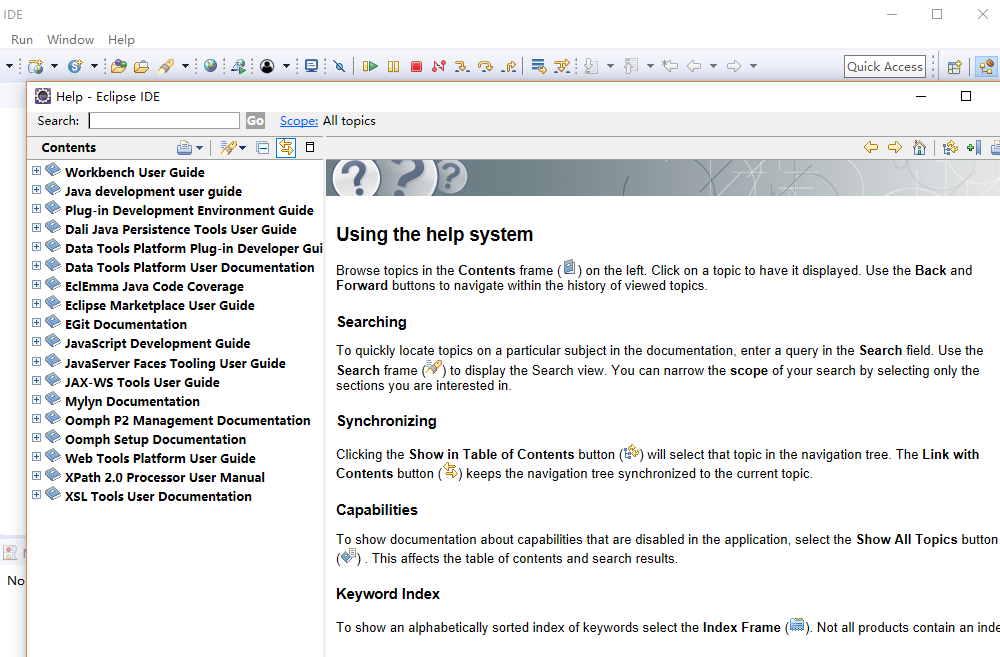
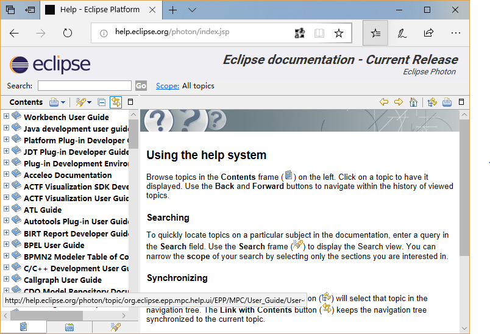
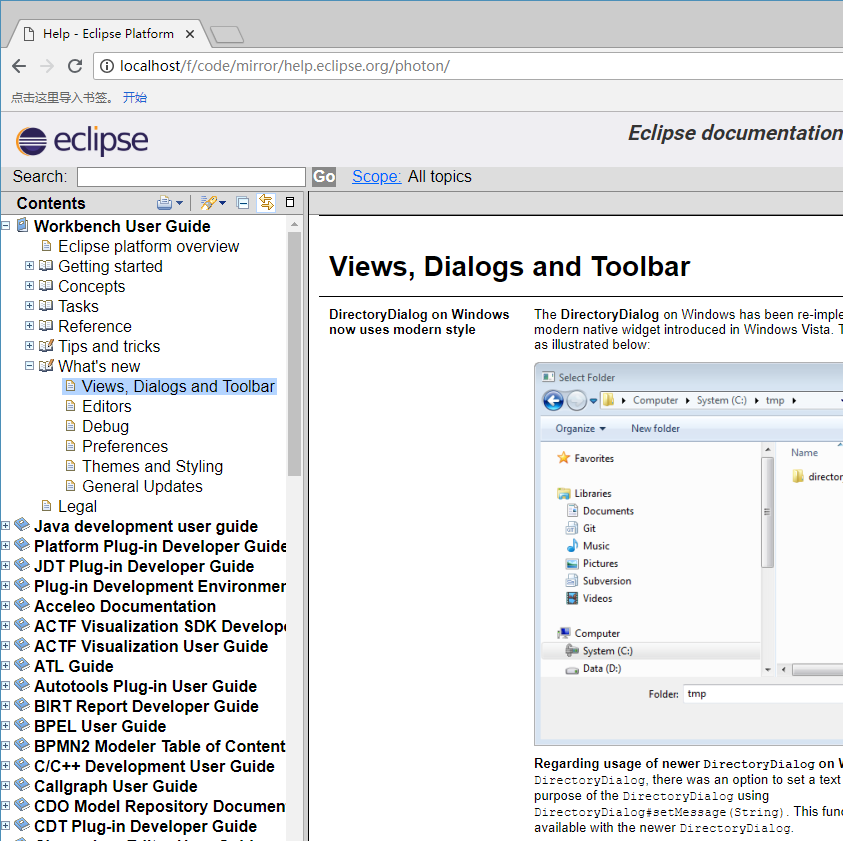

# 如何镜像 [help.eclipse.org](http://help.eclipse.orgp) 到本地。

[help.eclipse.org](http://help.eclipse.orgp) 是eclipse 各个版本使用帮助网站,在eclipse中也可以直接打开 菜单 `Help - Help Contents` , 每个版本的新功能都会有说明,虽然也有大部分内容是没有更新直接带到新版本上。内容基本都是静态网页，直接镜像到本地 可以比较方便查看。

本次示例 镜像 `eclipse photon` 为例子 ,使用的浏览器为火狐

# 步骤

打开 [Help - Eclipse Platform](http://help.eclipse.org/photon/index.jsp) ,左侧的 目录 [Contents](http://help.eclipse.org/photon/advanced/tocView.jsp?view=toc) 单独新窗口打开,火狐中可以鼠标右键 `此框架 - 新建标签页打开框架(T)`。

此页的数据点击结点时候动态加载 xml 生成的,需要展开所有节点获取数据。按 `F12` 打开开发者工具,火狐中为 `Firefox 开发工具` ,以执行脚本代替手动手动点击,另外 `开发者工具-网络` 中也可以记录每次的请求与相应。先在 开发者工具 的控制台 执行 脚本1。来展开页面所有待展开项。大约有2000+次请求后,页面完全展开。在  `开发者工具-网络` 中 选中某次请求右键 `所有内容另存为 HAR`,由于请求过多。可能会比较慢,获取 `Archive.har` 文件备用。在控制台执行 `脚本2` 获取当前页面所有超链接的文件 ，另存为`link.txt`备用 ,里面大约有7000+ 超链接。

使用 脚本3 `wget -p -i  link.txt` 下载文件，为了下载网络的稳定性,可以找一台`VPS`远程服务器下载，最后打包回本地。
下载完后 获取一个 `help.eclipse.org` 文件夹 ，大小: 343 MB (360,072,599 字节) 包含 18,150 个文件，4,026 个文件夹。

重新打开 [Help - Eclipse Platform](http://help.eclipse.org/photon/index.jsp) ，将网页另存为 到`help.eclipse.org/photon` 目录，文件名为 `index.html`。相关的文件自动保存在 `index_files` 目录下。如果使用火狐保存`index_files`目录下会有多层次目录，不方便,这使用 `chrome` 浏览器来保存文件 ,所有文件都在 `index_files` ,并且没有子目录。


HTTP服务器 `apache` 或者 `nginx` 配置过略，在浏览器中打开本地的地址 `help.eclipse.org/photon/index.html` ,此时控制台报错 `tocfragment` 无法加载。将
[help.eclipse.org/photon/advanced/tocfragment](http://help.eclipse.org/photon/advanced/tocfragment)
另存为`tocfragment` 放至相应路径 `help.eclipse.org\photon\index_files\`。

此时目录页`/help.eclipse.org/photon/index_files/tocView.html`是读取过xml文件后渲染出来的页面，不是原始的html页面。需要执行脚本4,使用`wget`保存一份原始的`tocView.html`来替换

修改`tocView.html`文件，将`imagesDirectory` 图片路径变量重新赋值为当前目录 `imagesDirectory = ".";`。
在 `script`节点最后使用`脚本5`以覆盖`tocTree.js`中的`makeNodeRequest`函数,以将动态请求的xml替换为静态的xml。


在 `Archive.har` 所在目录 创建子目录`tocfragment-toc`,并打开nodejs的控制台`repl`执行脚本6提取xml文件
将`tocfragment-toc`文件夹复制到`help.eclipse.org\photon\index_files`目录下。
注意重写`makeNodeRequest`函数里面是`encodeURIComponent`编码两次，而脚本6中只编码一次。
 

如果使用的是`nginx`,对于`help.eclipse.org/photon/nav/0` 这样的链接 响应头里面会写`application/octet-stream`，导致浏览器出现强制下载，如脚本7`default_type "";`取消默认类型即可。详细配置查看官网说明 [Module ngx_http_core_module](http://nginx.org/en/docs/http/ngx_http_core_module.html#default_type)
 
# 命令脚本
```js

//脚本1 展开页面所有元素
var plusSum = 0;//点击计数器
//两分钟执行一次点击事件,视网络情况 可以调整 600毫秒 左右
var plus_interval = setInterval(function () {
    plusSum++;
    //网络最后会拥堵 控制9次休息一下
    if (plusSum % 10 > 9) {
        return;
    }
	//查询当前所有待展开的第一个图片
    var plusImg = document.querySelector('img[src="images/plus.gif"].expander');
	//图片没问题展开 否则停止定时器
    plusImg ? plusImg.click() : clearInterval(plus_interval);
}, 2000);

//脚本2 提取超链接
var hrefs = Array.from(document.querySelectorAll('a'))
//去掉查询参数 去重 排序
hrefs = hrefs.map(a => a.href)
    .map(href => href.split('?')[0])//去掉问号部分
    .filter((x, i, a) => a.indexOf(x) == i)//同元素只保留第一个
    .sort();
//新窗口获取 超链接列表文件
window.open("data:application/octet-stream," + encodeURIComponent(hrefs.join('\n')));


//脚本5 请求xml的url替换为静态数据
function makeNodeRequest(parameters) {
    var href;
    href = ajaxPath +parameters; 
    //"tocfragment"+"?toc=/org.eclipse.platform.doc.user/toc.xml"
    //tocfragment?toc=/org.eclipse.platform.doc.user/toc.xml
    //tocfragment-toc/org.eclipse.platform.doc.user%2Ftoc.xml
    //将动态数据转换为静态数据  注意 条件运算符必须在括号里面
    href = ajaxPath + (!parameters.startsWith('?toc=/')?parameters:('-toc/' + encodeURIComponent(encodeURIComponent(parameters.substr(6))))); 
    var callback = function(xml) { updateTocTree(xml);}; 
    var errorCallback = function() { 
        // alert("ajax error"); 
    };
    ajaxRequest(href, callback, errorCallback);
}


//脚本6 nodejs脚本 从har文件中提取xml保存到文件
JSON.parse(fs.readFileSync('Archive.har', 'utf-8')).
    log.entries.
    filter(entrie =>
        entrie.request.url.indexOf('tocfragment?toc=/') >= 0 && entrie.response.status == 200
    ).
    forEach(entrie =>
        fs.writeFileSync('tocfragment-toc/' + encodeURIComponent(entrie.request.url.split('?toc=/')[1]), entrie.response.content.text)
    );

```

```shell

##脚本3 shell脚本下载超链接
## ‘-i file’ ‘--input-file=file’
##   Read URLs from a local or external file. 从本地文件读取链接
## ‘-p’ ‘--page-requisites’ 
##   This option causes Wget to download all the files that are necessary to properly display a given HTML page.
##   获取页面上的必要元素 如 js css 和图片
wget -p -i  link.txt


## 脚本4 单独下载页面
## ‘-nd’ ‘--no-directories’
##     Do not create a hierarchy of directories when retrieving recursively. 
##     不创建多余的目录,所有文件在同一个目录下
wget  -p  -nd   http://help.eclipse.org/photon/advanced/tocView.jsp?view=toc

```

```conf
#脚本7 取消nginx的默认类型
  location /f/ {
	   default_type "";
	   autoindex on;
	   alias F:/ ; 
  }

```

# 图片


 
 eclipse中打开帮助

 

  
 浏览器访问

 


 本地访问

 

