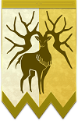
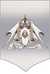
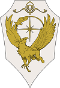

主角/不可思議的少女

黑鷲學級    
艾黛尔贾特 修伯特    
菲尔迪南特 林哈尔特 卡斯帕尔 贝尔娜提塔 多洛缇雅 佩托拉    

青獅子學級        
帝弥托利 杜笃    
菲力克斯 亚修 希尔凡 梅尔赛德司 雅尼特 英谷莉特

金鹿學級    
库罗德 洛廉兹    
拉斐尔 伊古纳兹 莉丝缇亚 玛莉安奴 希尔妲 雷欧妮

 

賽羅司聖教會/士官學校       
蕾雅 西提司 芙莲
汉尼曼 玛努艾拉 锥里尔
 

賽羅司騎士團    
杰拉尔特 卡多莉奴 阿罗伊斯 吉尔伯特 萨米亚

其他勢力    
炎帝 死神騎士  クロニエ  ソロン タレス

# 艾黛尔贾特
    

## 职业    
**▲** : 剑术 , 斧术 , 重装 , 指挥    
**▼** : 箭术 , 信仰    
**★** : 理学    
    

## 挖角条件    
不可挖角    

## 失物    
白色的手套 , 古老的羽毛笔 , 东方瓷器    

## 兴趣    
读书 , 独自散步    

## 喜欢的东西    
优秀的人 , 讨论历史观和战略 , 大自然 , 美丽的风景    

## 讨厌的东西    
旧有价值观 , 纹章 , 老鼠 , 锁链 , 游泳 , 表露出不能自已的态度    

## 喜好礼物    
熊玩偶 , 桌面游戏 , 帝王学之书 , 康乃馨    

## 喜好茶叶    
香柠檬茶    

## 茶话会最佳选项    
关于纹章的有无 , 向喜欢的人寻求的事物 , 喜欢的点心 , 关于两人的将来 , 修道院规则的话题 , 想要变得更亲密 , 看过歌剧吗？ , 相遇之时的话题 , 关于桥上的风景 , 说出自己的秘密 , 发牢骚 , 关于道具的保养 , 在危机之际获救的话题 , 最近读过的书的话题 , 学校生活的回忆 , 讲述理想的教师形象 , 两人曾一同欢笑的话题 , 关于想成为的兵种 , 一直以来谢谢你了 , 希望成为伙伴的人 , 猫的话题 , 看来你状况不错 , 喜欢的地方 , 觉得最优秀的伙伴 , 收到会很开心的礼物 , 关于修道院的警备 , 最近你的气质改变了 , 关于图书馆的藏书 , 学校制服的话题 , 关于修道院的谜团 , 应该适合的兵种 , 上次战斗的反省 , 新计策的提案 , 精悍骑士团的传言 , 其他伙伴的评价 , 为了克服弱点 , 未来的梦想 , 任何事都可以和我商量 , 芙朵拉的将来 , 想懒洋洋地度过 , 我信赖着你    

## 信件答案    
我算是喜欢甜食的人。但是，只有帝都安巴尔传统点心喜欢不起来……为什么那样的东西会变成传统呢……
是太甜了吗？    
天冷的时候只要多披上几件衣服就好，但在大热天总不能全身赤裸。该如何度过炎热的夏天呢？
集中精神在看书等事情上就会过去了。    
即使我明白在前线战斗的危险性，但也无法不亲上前线……有方法能至少降低危险性吗？
攻击就是最好的防御。    
青海之星上有女神?还真能说呢。根据天文学者的新学说，那颗星的光芒是花费了数万年的时间才传递过来的。
女神的传说很多都是捏造的。

*艾黛尔贾特 Edelgard*

# 修伯特
    

## 职业    
**▲** : 箭术 , 理学 , 指挥    
**▼** : 斧术 , 信仰 , 飞行    
**★** : 枪术    
    

## 挖角条件    
不可挖角    

## 失物    
弗雷斯贝尔古战争论 , 可疑的手帕 , 折叠式剃刀    

## 兴趣    
研究战略和战术 , 观察艾黛尔贾特    

## 喜欢的东西    
嘲讽 , 特芙 , 帮得上主公忙的人 , 聪明人    

## 讨厌的东西    
赛罗司教 , 赌博 , 高处 , 聊往事 , 妨碍主公的人 , 愚蠢的人    

## 喜好礼物    
特芙豆 , 桌面游戏 , 芙朵拉史书    

## 喜好茶叶    
鞑古扎风味茶 , 肉桂茶    

## 茶话会最佳选项    
强大武器的话题 , 精悍骑士团的传言 , 修道院规则的话题 , 为了让计谋成功 , 在危机之际获救的话题 , 其他伙伴的评价 , 那个人的年龄 , 关于两人的连携 , 想去旅行看看的国家 , 芙朵拉的将来 , 说出自己的秘密 , 我信赖着你 , 关于道具的保养 , 视为目标的任务 , 最近读过书的话题 , 关于想成为的兵种 , 希望成为伙伴的人 , 觉得最优秀的伙伴 , 关于修道院的警备 , 关于图书馆的藏书 , 关于修道院的谜团 , 上次战斗的反省 , 新计策的提案    

## 信件答案    
说到大局上的战略，“弗雷斯贝尔古战争论”肯定是首屈一指，但若要研究对局部的战略，不觉得那本书也相当厉害吗?
奇霍尔用兵总论。    
别看我这样，其实我对飞马骑士很感兴趣。从高处眺望一定很爽快吧。然而，这是无法实现的梦想......
是因为怕高吗?    
明明选择了迎合他人的生存之道，死到临头才突然爱惜起自己的生命。完全搞不懂愚者的想法啊。
搞不懂就无法支配他们。    
小时候会害怕天谴或是死者的怨念，现在则是狂热信徒的刀刃与生者的恨意才更令人恐惧……
令人恐惧的是现实。

*修伯特 Hubert*

# 菲尔迪南特
    

## 职业    
**▲** : 剑术 , 枪术 , 斧术 , 马术    
**▼** : - , 
    
**★** : -    
    

## 挖角条件    
技巧 , 重装    

## 失物    
武具用的油壶 , 农业租税的报告书 , 装有茶叶的小袋子    

## 兴趣    
保持贵族的风范 , 收集武具    

## 喜欢的东西    
骑马 , 红茶 , 正义 , 符合贵族身份的言行 , 高处    

## 讨厌的东西    
怠惰 , 没有贵族样的贵族    

## 喜好礼物    
骑马用靴子 , 刀具用磨刀石 , 红茶的茶叶    

## 喜好茶叶    
东方风味茶 , 南方果茶 , 赛罗司茶    

## 茶话会最佳选项    
关于纹章的有无 , 学校制服的话题 , 料理失败的话题 , 打扮的话题 , 强大武器的话题 , 邀请一同用餐的对象 , 午餐的话题 , 理想的交往方式 , 看来你过得不错 , 应该适合的兵种 , 修道院规则的话题 , 向喜欢的人寻求的事物 , 在市场的孩子的话题 , 晚餐的邀约 , 看过歌剧吗 , 关于两人的将来 , 发牢骚 , 现在心跳得很厉害 , 在危机之际获救的话题 , 初恋的话题 , 学校生活的回忆 , 想要变得更亲密 , 两人曾一同欢笑的话题 , 说出自己的秘密 , 一直以来谢谢你了 , 关于道具的保养 , 关于浴场的设备 , 讲述理想的教师形象 , 喜欢的地方 , 关于想成为的兵种 , 那个人的年龄 , 看来你状况不错 , 优秀骑士的话题 , 觉得最优秀的伙伴 , 可爱修道士的话题 , 上次战斗的反省 , 想一起训练的对象 , 其他伙伴的评价 , 在意的伙伴的话题 , 未来的梦想 , 收到会很开心的礼物 , 关于两人的连携 , 最近你的气质改变了 , 芙朵拉的将来 , 精悍骑士团的传言 , 我信赖着你 , 任何事都可以跟我商量 , 视为目标的任务 , 何谓贵族的生存方式    

## 信件答案    
大修道院里的红茶无法满足我。虽然也可以请家里送来，但有没有人看起来拥有与贵族相称的红茶呢？
洛廉兹。    
也有很多人对当今帝国感到失望，必须有人带入一股新风气才行。干脆推举一个新人选当皇帝吧？
推荐菲尔迪南特较好。    
并不是想留长头发才留的。只是生活过于忙碌，一不注意就……被误会成在耍帅，令我很难过。
很适合你。    
贵族总是十分从容，从旁人眼里看来，甚至还很优雅。不过，有需要连在战场上也要追求优雅吗？
活下来才是最重要的。

*菲尔迪南特 Ferdinand*

# 林哈尔特
    

## 职业    
**▲** : 理学 , 信仰    
**▼** : 斧术 , 格斗术    
**★** : -    
    

## 挖角条件    
魔力 , 理学    

## 失物    
四圣人的真相 , 羽绒枕 , 以魔法操纵的假饵    

## 兴趣    
所有跟睡觉相关的事 , 纹章学的研究    

## 喜欢的东西    
睡午觉 , 晚起 , 读书 , 钓鱼 , 甜食 , 自由    

## 讨厌的东西    
争执 , 血 , 武器 , 勤奋 , 义务 , 束缚 , 政治 , 鬼怪    

## 喜好礼物    
美味的烤点心 , 图解纹章 , 钓鱼用浮漂    

## 喜好茶叶    
东方风味茶 , 草本茶    

## 茶话会最佳选项    
关于纹章的有无 , 最近读过书的话题 , 关于钓鱼池的怪鱼 , 门卫工作时间的话题 , 喜欢的点心 , 觉得最优秀的伙伴 , 关于桥上的风景 , 关于图书室的藏书 , 发牢骚 , 关于修道院的谜团 , 两人曾一同欢笑的话题 , 未来的梦想 , 一直以来谢谢你了 , 为了克服弱点 , 忘了收获的话题 , 任何事都可以跟我商量 , 猫的话题 , 午睡的话题 , 喜欢的地方 , 收到会很开心的礼物 , 想去旅行看看的国家 , 晚餐的邀约 , 想要变得更亲密 , 相遇之时的话题 , 说出自己的秘密    

## 信件答案    
虽然我会在大修道院的各处睡觉，但最近想试着在新地点睡睡看。有没有推荐的地方呢?
开满玫瑰花的中庭。    
我是独生子。要是不继承爵位，我的父母只能从别处领养孩子，或者努力再生一个孩子呢。
在毕业前慢慢考虑就好了。    
曾经我认为在战场上戴面具是相当愚蠢的行为……但或许那样也好呢。毕竟这样就不需要跟对手对上眼了。
别对自己的所作所为视若罔闻。    
以前光是溅到敌人的血就几乎要失去意识。但现在即使满脸鲜红也不会昏倒……唔呃，开始觉得恶心了。
持续忍受恶心下去就好了。

*林哈尔特 Linhardt*

# 卡斯帕尔
    

## 职业    
**▲** : 斧术 , 格斗术    
**▼** : 箭术 , 格斗术    
**★** : -    
    

## 挖角条件    
力量 , 格斗术    

## 失物    
“雷霆”的仿剑 , 有破洞的上衣 , 避雷护符    

## 兴趣    
活动身体 , 早睡早起吃饭快    

## 喜欢的东西    
打架 , 锻炼 , 惩奸除恶    

## 讨厌的东西    
谎言 , 不公正的事 , 安静地待着 , 下雨    

## 喜好礼物    
训练用的重物 , 刀具用磨刀石 , 狩猎用短剑 , 烟熏肉    

## 喜好茶叶    
姜茶    

## 茶话会最佳选项    
关于钓鱼池的怪鱼 , 相遇之时的话题 , 料理失败的话题 , 关于道具的保养 , 强大武器的话题 , 门卫工作时间的话题 , 午餐的话题 , 关于想成为的兵种 , 看来你过得不错 , 看来你状况不错 , 在市场的孩子的话题 , 上次战斗的反省 , 关于桥上的风景 , 新计策的提案 , 终极食谱的话题 , 未来的梦想 , 发牢骚 , 关于两人的连携 , 在危机之际获救的话题 , 我信赖着你 , 想一起吃的料理 , 视为目标的任务 , 学校生活的回忆 , 精悍骑士团的传言 , 两人曾一同欢笑的话题 , 为了克服弱点 , 一直以来谢谢你了 , 任何事都可以跟我商量 , 忘了收获的话题 , 长高的方法 , 猫的话题 , 应该适合的兵种 , 关于浴场的设备 , 晚餐的邀约 , 喜欢的地方 , 关于两人的将来 , 优秀骑士的话题 , 想要变得更亲密 , 想一起训练的对象 , 想去旅行看看的国家    

## 信件答案    
哼，就算个子有点矮，我也完全不介意！……可是如果有吃了就能长高的东西，我倒是想听听看啦。
充足的睡眠更有帮助。    
强大得能流芳后世的家伙，大多数是用剑或枪的吧？身为战士想要名留青史，果然不用那些武器是不行的吗？
用自己擅长的武器战斗就可以了。    
我不擅长当敌人在面前时按兵不动。当然不是我办不到，只是埋伏之类的，跟我的个性不符啊……
你越沉得住气，就会变得越强。    
喜欢骑士的那群家伙常说的“骑士精神中不可或缺的”是什么呢？我并不想当骑士，所以搞不太懂。
坚强与勇气。

*卡斯帕尔 Caspar*

# 贝尔娜提塔
    

## 职业    
**▲** : 箭术 , 枪术    
**▼** : 剑术 , 斧术 , 格斗术 , 重装    
**★** : 马术    
    

## 挖角条件    
力量 , 箭术    

## 失物    
刺绣针及卷线筒 , 鲜艳的花朵静物画 , 刺猬箱子    

## 兴趣    
刺绣和编织 , 撰写附带插画的小说    

## 喜欢的东西    
读书 , 画画 , 音乐 , 刺绣 , 罕见的植物 , 布偶 , 孤单一人    

## 讨厌的东西    
与其他人接触和对话 , 可怕的人 , 父亲    

## 喜好礼物    
熊玩偶 , 乐谱集 , 浇花器 , 美丽的风景画 , 美丽的手帕 , 莱佛士猪笼草    

## 喜好茶叶    
莓茶 , 蜜渍水果茶    

## 茶话会最佳选项    
料理失败的话题 , 打扮的话题 , 喜欢的点心 , 在中庭的两人的话题 , 午餐的话题 , 两人的交往方式 , 看来你过得不错 , 想去旅行看看的国家 , 在市场的孩子的话题 , 向喜欢的人寻求的事物 , 关于桥上的风景 , 想要变得更亲密 , 终极食谱的话题 , 相遇之时的话题 , 发牢骚 , 说出自己的秘密 , 在危机之际获救的话题 , 最近读过的书的话题 , 想一起吃的料理 , 看来你状况不错 , 学校生活的回忆 , 关于图书室的藏书 , 两人曾一同欢笑的话题 , 上次战斗的反省 , 一直以来谢谢你了 , 未来的梦想 , 猫的话题 , 我信赖着你 , 喜欢的地方 , 为了克服弱点 , 可爱修道士的话题 , 任何事都可以跟我商量 , 在意的伙伴的话题 , 食虫植物的话题 , 收到会很开心的礼物 , 学校制服的话题 , 最近你的气质改变了    

## 信件答案    
老师，来当笔友吧，笔友！就是双方不需要面对面地生活，实在困扰的时候就隔着门对话……
我想看你的脸。    
我希望能有更多时间去享受兴趣。明明有很多想做的事，但等到大家入睡再开始的话，时间根本不够啊……
人生在世，有时放弃也是很重要的。    
我经常跌倒，但要是在战场上跌倒了该怎么办呢？会死吗？会死对吧！？
我倒是希望你想想敌人跌倒时该怎样做。    
还以为贵族是更加伟大的存在……亏我还相信，只要我说想当个家里蹲，就会让我当家里蹲的啊啊啊……
要是变得更伟大，就能当家里蹲吧。

*贝尔娜提塔 Bernadetta*

# 多洛缇雅
    

## 职业    
**▲** : 箭术 , 理学    
**▼** : 信仰 , 马术 , 飞行    
**★** : 信仰    
    

## 挖角条件    
魅力 , 指挥    

## 失物    
魔银的胸饰 , 奇迹的歌姬的传单 , 玳瑁制的梳子    

## 兴趣    
-    

## 喜欢的东西    
唱歌 , 音乐 , 舞台 , 装饰品 , 小动物    

## 讨厌的东西    
傲慢的贵族 , 自己    

## 喜好礼物    
熊玩偶 , 乐谱集 , 浇花器 , 美丽的风景画 , 美丽的手帕 , 莱佛士猪笼草    

## 喜好茶叶    
苹果茶 , 莓茶    

## 茶话会最佳选项    
关于钓鱼池的怪鱼 , 邀请一同用餐的对象 , 看来你过得不错 , 在中庭的两人的话题 , 修道院规则的话题 , 理想的交往方式 , 看过歌剧吗 , 向喜欢的人寻求的事物 , 发牢骚 , 晚餐的邀约 , 在危机之际获救的话题 , 关于两人的将来 , 学校生活的回忆 , 现在心跳的很厉害 , 两人曾一同欢笑的话题 , 初恋的话题 , 一直以来谢谢你了 , 想要变得更亲密 , 关于浴场的设备 , 相遇之时的话题 , 喜欢的地方 , 说出自己的秘密 , 优秀的骑士话题 , 最近读过书的话题 , 可爱修道士的话题 , 门卫工作时间的话题 , 想一起训练的对象 , 看来你状况不错 , 在意的伙伴的话题 , 关于修道院的警备 , 收到会很开心的礼物 , 新的计策的提案 , 最近你的气质改变了 , 其他伙伴的评价 , 学校制服的话题 , 未来的梦想 , 打扮的话题 , 关于两人的连携 , 视为目标的任务 , 我信赖着你 , 一切尽在不言中    

## 信件答案    
即使有爱，没有钱还是无法生存的吧。我啊，虽然想和某人共度余生，但绝对不想再回到那段贫困的时光了。
想要两者兼得呢。    
歌曲或舞蹈虽然会留在记忆中，却不会留下记录。而且，记忆会逐渐淡……我能否停留在某人心中呢？
总有一人会铭记在心的。    
期望他人死亡与杀死他人，有何不同？以亲手做出了断这一点来看，选择杀人会比较好吗？
一切都因自己的想法而异。    
如果有人难以入眠，我可以为他唱首摇篮曲。但还真没办法唱给自己听。有没有什么好办法呢？
稍微活动筋骨，累了便会容易入睡。

*多洛缇雅 Dorothea*

# 佩托拉
    

## 职业    
**▲** : 剑术 , 斧术 , 箭术 , 飞行    
**▼** : 理学 , 信仰    
**★** : -    
    

## 挖角条件    
技巧 , 马术    

## 失物    
鲜艳的羽毛饰品 , 小张鞣制皮革 , 写满笔记的辞典    

## 兴趣    
狩猎和鞣制皮革 , 学习    

## 喜欢的东西    
在海中游泳 , 太阳 , 爬树 , 家人 , 故乡    

## 讨厌的东西    
数字 , 偷懒 , 差别待遇    

## 喜好礼物    
狩猎用短剑 , 异国辛香料 , 烟熏肉 , 向日葵    

## 喜好茶叶    
四种香料茶 , 姜茶    

## 茶话会最佳选项    
关于钓鱼池的怪鱼 , 最近你的气质改变了 , 强大的武器的话题 , 打扮的话题 , 看来你过得不错 , 理想的交往方式 , 修道院规则的话题 , 想去旅行看看的国家 , 关于桥上的风景 , 应该适合的兵种 , 在危机之际获救的话题 , 向喜欢的人寻求的事物 , 想一起吃的料理 , 晚餐的邀约 , 学校生活的回忆 , 关于两人的将来 , 两人曾一同欢笑的话题 , 现在心跳的很厉害 , 一直以来谢谢你了 , 想要变得更亲密 , 猫的话题 , 关于道具的保养 , 关于浴场的设备 , 最近读过的书的话题 , 喜欢的地方 , 门卫工作时间的话题 , 想一起训练的对象 , 关于想成为的兵种 , 在意的伙伴的话题 , 看来你状况不错 , 收到会很开心的礼物 , 觉得最优秀的伙伴 , 我信赖着你 , 关于修道院的警备 , 视为目标的任务 , 关于图书室的藏书 , 精悍骑士团的传言 , 关于修道院的谜团 , 为了克服弱点 , 上次战斗的反省 , 任何事都可以跟我商量 , 新计策的提案 , 在海中游泳的话题 , 其他伙伴的评价 , 关于两人的连携 , 未来的梦想 , 芙朵拉的将来    

## 信件答案    
我、喜欢、大海。加尔古，玛库、海、很远……朝着、海边、前进、游泳、是当务之急。没办法吗？
改天去南方的海边吧。    
藏书室、很棒。但是、有一个、不满之处。那本书、布里基特的情报、不充分。我、希望能、将它补足。
诸游纪行？    
期望他人死亡与杀死他人，有何不同？以开始习惯书写文章了。下一步我想掌握口语，却总是力不从心。请教我一些诀窍。
难道这……佩托拉写的？    
虽说加尔古·玛库周围有丰富的自然资源，但战争时，粮食会不太够呢。果然和故乡状况不同。
故乡……是指布里基特吗？

*佩托拉 Petra*

# 帝弥托利
    

## 职业    
**▲** : 剑术 , 枪术 , 指挥    
**▼** : 斧术 , 理学    
**★** : 马术    
    

## 挖角条件    
不可挖角    

## 失物    
变钝的长剑 , 黑色皮手套 , 培训记录册    

## 兴趣    
进行武术练习 , 锻炼 , 保养武具    

## 喜欢的东西    
战斗 , 优质的武具 , 锻炼身体 , 骑马远行 , 体力活    

## 讨厌的东西    
精细的作业 , 容易坏的东西 , 炎热 , 考量利害关系    

## 喜好礼物    
训练用的重物 , 刀具用磨刀石 , 骑马用靴子 , 装饰用的剑    

## 喜好茶叶    
洋甘菊花茶    

## 茶话会最佳选项    
关于图书室的藏书 , 料理失败的话题 , 上次战斗的反省 , 强大武器的话题 , 新计策的提案 , 看来你过得不错 , 其他伙伴的评价 , 修道院规则的话题 , 关于两人的提携 , 在市场的孩子的话题 , 芙朵拉的将来 , 关于桥上的风景 , 我信赖着你 , 发牢骚 , 视为目标的人物 , 在危机之际获救的话题 , 精悍骑士团的传言 , 学校生活的回忆 , 为了克服弱点 , 两人曾一同欢笑的话题 , 任何事都可以跟我商量 , 一直以来谢谢你了 , 关于耐用的武器 , 喜欢的地方 , 最近读过的书的话题 , 想一起训练的对象 , 门卫工作时间的话题 , 想一起训练的对象 , 讲述理想的教师形象 , 想去旅行看看的国家 , 关于想成为的兵种 , 想要变得更亲密 , 希望成为伙伴的人 , 相遇之时的话题 , 看来你状况不错 , 关于道具的保养 , 关于修道院的警备    

## 信件答案    
我平常都会压抑力道去挥动武器……但有好几次控制不好，把武器弄坏了。这该如何是好呢?
频繁地修理武器。    
我从小开始就对炎热没辙……不过，今后不晓得会在何种环境下开战。有没有什么熬过炎热的好方法呢……
重新考虑装备的材质。    
可能是现在只剩下一只眼睛的关系，开始办公就会让眼睛特别疲劳。有没有不让工作效率降低的方法呢？
请人调配眼药水吧。    
长时间在贫民窟中度过，在那里我亲眼看见苦于战乱与贫苦的人们。究竟要如何才能拯救他们……
改变国家的现状。

*帝弥托利 Dimitri*

# 杜笃
    

## 职业    
**▲** : 枪术 , 斧术 , 格斗术 , 重装    
**▼** : 信仰 , 马术 , 飞行    
**★** : -    
    

## 挖角条件    
不可挖角    

## 失物    
金耳环 , 园艺用整枝剪 , 铁锅    

## 兴趣    
所有家务 , 钻研厨艺    

## 喜欢的东西    
园艺 , 刺绣 , 花朵 , 工艺    

## 讨厌的东西    
对帝弥托利不利的人    

## 喜好礼物    
异国辛香料 , 美丽的切花 , 浇花器    

## 喜好茶叶    
肉桂茶 , 四种香料茶 , 姜茶    

## 茶话会最佳选项    
关于钓鱼池的怪鱼 , 希望成为伙伴的人 , 料理失败的话题 , 觉得最优秀的伙伴 , 喜欢的点心 , 关于修道院的警备 , 午餐的话题 , 上次战斗的反省 , 终极食谱的话题 , 关于两人的连携 , 想一起吃的料理 , 芙朵拉的将来 , 一直以来谢谢你了 , 我信赖着你 , 忘了收获的话题 , 视为目标的人物 , 喜欢的地方 , 精悍骑士团的传言 , 想一起训练的对象 , 为了克服弱点 , 收到会很开心的礼物 , 任何事都可以跟我商量 , 晚餐的邀约 , 帝弥托利的话题 , 相遇之时的话题 , 关于道具的保养 , 门卫工作时间的话题 , 关于想成为的兵种    

## 信件答案    
在温室照顾花朵的时候，较晚进来的女学生一看到我的脸就逃走了。我不记得对她做过什么啊……
你确定没有皱起眉头吗？    
我希望能成为殿下更大的助力。但是，像我这样的人能为那位大人做些什么呢……
豁出性命去守护他。    
就算是那位大人，要是整天都埋头工作，身体也会出问题的。到底该怎么做才能让他好好休息呢……
试着约他一起吃饭吧。    
可能是这张脸太可怕了，从以前就不被动物亲近。连战马和飞龙也是。想做点什么改善，但该怎么做……
用头盔遮住脸庞。

*杜笃 Dedue*

# 菲力克斯
    

## 职业    
**▲** : 剑术 , 箭术 , 格斗术    
**▼** : 理学 , 指挥    
**★** : 理学    
    

## 挖角条件    
速度 , 剑术    

## 失物    
黑铁的马刺 , 佩剑带的金属配件 , 栉刃的短剑    

## 兴趣    
进行剑术练习 , 保养武具    

## 喜欢的东西    
战斗 , 优质的武具 , 肉 , 辣的食物 , 狩猎    

## 讨厌的东西    
开玩笑 , 甜食 , 骑士精神 , 父亲    

## 喜好礼物    
烟熏肉 , 狩猎用短剑 , 训练用的重物 , 装饰用的剑    

## 喜好茶叶    
东方风味茶 , 四种香料茶    

## 茶话会最佳选项    
强大武器的话题 , 上次战斗的反省 , 午餐的话题 , 新计策的提案 , 在市场的孩子的话题 , 其他伙伴的评价 , 看过歌剧吗 , 未来的梦想 , 想一起吃的料理 , 关于两人的提携 , 猫的话题 , 我信来着你 , 喜欢的地方 , 视为目标的人物 , 想一起训练的对象 , 精悍骑士团的传言 , 应该适合的兵种 , 为了克服弱点 , 相遇之时的话题 , 想了新的剑技 , 关于道具的保养 , 关于想成为的兵种 , 希望成为伙伴的人 , 看来你状况不错 , 觉得最优秀的伙伴 , 关于修道院的警备    

## 信件答案    
只要待在这所士官学校，就会发现仗着纹章之力或贵族地位而不锻炼的笨蛋居然有如此之多，真是让人惊讶得无言以对。
去做他们的训练对手吧。    
虽然有人叫我学学怎么开玩笑，但学习那种事有什么意义呢？
能缓和开战前的紧张气氛。    
年幼时，曾有一次对父亲动手。现在回想起来，那家伙当时也许也很苦恼。我很想对他道款……但已经太迟了。
这就是人生啊。    
若这场战争结束，能战斗的机会就会一下子减少……到了那时，我该以什么为目标，该为了什么而磨练剑术呢？
以成为芙朵拉最强的人为目标吧。

*菲力克斯 Felix*

# 亚修
    

## 职业    
**▲** : 斧术 , 箭术    
**▼** : 理学    
**★** : 枪术    
    

## 挖角条件    
魅力 , 枪术    

## 失物    
月骑士与蔷薇公爵 , 除魔护符 , 香草束    

## 兴趣    
读书 , 烹饪    

## 喜欢的东西    
甜食 , 骑土精神文学 , 旅行游记 , 和小孩子相处 , 紫罗兰    

## 讨厌的东西    
鬼怪 , 密闭空间 , 暴力欺压 , 谎言    

## 喜好礼物    
骑士精神文学 , 异国辛香料 , 美味的烤点心 , 古代硬币 , 紫罗兰    

## 喜好茶叶    
薄荷茶 , 草本茶    

## 茶话会最佳选项    
关于纹章的有无 , 想去旅行看看的国家 , 关于钓鱼池的怪鱼 , 晚餐的邀约 , 喜欢的点心 , 想要变得更亲密 , 看来你过得不错 , 关于道具的保养 , 在市场的孩子的话题 , 最近读过的书的话题 , 终极食谱的话题 , 门卫工作时间的话题 , 发牢骚 , 讲述理想的教师形象 , 在危机之际获救的话题 , 关于想成为的兵种 , 想一起吃的料理 , 关于修道院的警备 , 学校生活的回忆 , 关于图书室的藏书 , 两人曾一同欢笑的话题 , 上次战斗的反省 , 一直以来谢谢你了 , 未来的梦想 , 忘了收获的话题 , 关于两人的提携 , 猫的话题 , 我信赖着你 , 优秀骑士的话题 , 视为目标的人物 , 收到会很开心的礼物 , 京汉骑士团的传言 , 关于理想的骑士 , 任何事都可以跟我商量    

## 信件答案    
我原本打算在藏书室借书的，结果太多书了我做不了决定。如果有推荐的书，还请告诉我。
法嘉斯建国史。    
我从以前开始就不擅长算术，擅长的话买东西就不会被骗了吧？我想努力克服这项弱点……
向擅长的人讨教。    
最近，我开始思考也许没有幽灵这种东西。可是，这样的话我小时候看到的那个到底是什么……
应该是魔法之类的东西吧。    
成为出色的骑士是我的梦想，但是离梦想实现还很遥……该怎么样才能更接近理想中的自己呢？
彻底贯彻自己的信念。

*亚修 Ashe*

# 希尔凡
    

## 职业    
**▲** : 枪术 , 斧术 , 马术    
**▼** : 箭术    
**★** : 理学    
    

## 挖角条件    
魅力 , 理学    

## 失物    
赠送用的口红 , 没有收件人的情书 , 斯灵的历史    

## 兴趣    
观看歌剧和艺术鉴赏 , 搭讪女性    

## 喜欢的东西    
女性 , 热闹的地方 , 桌上游戏    

## 讨厌的东西    
闷臭的空气 , 嫉妒 , 炎热    

## 喜好礼物    
美丽的风景画 , 美丽的手帕 , 桌面游戏    

## 喜好茶叶    
香柠檬茶 , 赛罗司茶    

## 茶话会最佳选项    
关于钓鱼池的怪鱼 , 想去旅行看看的国家 , 料理失败的话题 , 应该适合的兵种 , 喜欢的点心 , 向喜欢的人寻求的事物 , 午餐的话题 , 晚餐的邀约 , 看来你过得不错 , 关于两人的将来 , 看过歌剧吗 , 现在心跳的很厉害 , 关于桥上的风景 , 初恋的话题 , 终极食谱的话题 , 想要变得更亲密 , 发牢骚 , 相遇之时的话题 , 在危机之际获救的话题 , 说出自己的秘密 , 想一起吃的料理 , 关于道具的保养 , 学校生活的回忆 , 最近读过的书的话题 , 两人曾一同欢笑的的话题 , 门卫工作时间的话题 , 一直以来谢谢你了 , 讲述理想的教师形象 , 关于浴场的设备 , 希望成为伙伴的人 , 喜欢的地方 , 看来你状况不错 , 那个人的年龄 , 觉得最优秀的伙伴 , 可爱修道士的话题 , 关于图书室的藏书 , 想一起训练的对象 , 关于修道院的谜团 , 在意的伙伴的话题 , 其他伙伴的评价 , 收到会很开心的礼物 , 未来的梦想 , 最近你的气质改变了 , 关于两人的连携 , 学校制服的话题 , 我信赖着你 , 打扮的话题 , 为了克服弱点 , 邀请一同用餐的对象 , 现在的交往对象是谁 , 在中庭的两人的话题 , 理想的交往方式    

## 信件答案    
即使对其他女人出手也能笑着原谅我，如此心胸宽广的美丽千金，在哪里能够遇得到……
或许将来会出现吧。    
一想到那家伙在隔壁房间，半夜都不太敢找女孩子来房间玩了。因为隔天早上那家伙责备人的时候，实在是太凶、太可怕了
我考虑一下重新分配房间……    
被接连不断的战争压得喘不过气了。能治愈我荒芜心灵的温柔美丽的小姐，在哪里能够遇得到呢……
或许将来会出现吧。    
无论睡着还是醒着都在不断战斗……这样的话，女孩们的笑容都要蒙上阴影了。让我们热闹地玩乐一番吧！
只是今晚的话，可以例外地……

*希尔凡 Sylvain*

# 梅尔赛德司
    

## 职业    
**▲** : 理学 , 信仰    
**▼** : 剑术 , 枪术 , 斧术 , 重装    
**★** : 箭术    
    

## 挖角条件    
魔力 , 箭术    

## 失物    
芙朵拉怪谈 , 糖渍水果 , 点心的做法    

## 兴趣    
做礼拜 , 做点心    

## 喜欢的东西    
甜食 , 刺绣 , 鬼故事 , 可爱的东西 , 画画 , 读书 , 很香的花    

## 讨厌的东西    
辣的食物 , 所有需要活动身体的事    

## 喜好礼物    
美味的烤点心 , 女神像的木雕 , 熊玩偶 , 装饰用辉石 , 薰衣草    

## 喜好茶叶    
莓茶 , 南方果茶 , 三日月茶    

## 茶话会最佳选项    
料理失败的话题 , 优秀骑士的话题 , 喜欢的点心 , 可爱修道士的话题 , 午餐的话题 , 在意的伙伴的话题 , 修道院规则的话题 , 收到会很开心的礼物 , 在市场上的孩子的话题 , 最近你的气质改变了 , 看过歌剧吗 , 学校制服的话题 , 终极食谱的话题 , 打扮的话题 , 发牢骚 , 邀请一同用餐的对象 , 想一起吃的料理 , 在中庭的两人的话题 , 学校生活的回忆 , 理想的交往方式 , 两人曾一同欢笑的的话题 , 想去旅行看看的国家 , 一直以来谢谢你了 , 晚餐的邀约 , 忘了收获的话题 , 现在心跳的很厉害 , 猫的话题 , 初恋的话题 , 关于浴场的设备 , 想要变得更亲密 , 喜欢的地方 , 说出自己的秘密 , 为了克服弱点 , 最近读过的书的话题 , 任何事都可以跟我商量 , 看来你状况不错 , 珍藏的鬼故事 , 关于图书室的藏书 , 我信赖着你 , 上次战斗的反省    

## 信件答案    
我的年纪比大家大一点，所以想成为更值得大家依赖的姐姐……
可是这真的好难啊～
不用勉强自己。    
虽然喜欢做菜，
但偶尔会调味失败～
想找个擅长的人来教教我啊……
亚修。    
从小开始我就不太擅长运动呢～我有没有成为大家的累赘呢？有什么我也能为大家尽一份力的事……
以美味的料理来鼓舞大家。    
感到疲惫的时候果然就会想吃甜食呢。要是有种利用有限的食材就能做出美味的甜点该有多好～
去藏书室借助前人的智慧吧。

*梅尔赛德司 Mercedes*

# 雅尼特
    

## 职业    
**▲** : 斧术 , 理学 , 指挥    
**▼** : 箭术 , 重装    
**★** : -    
    

## 挖角条件    
魔力 , 信仰    

## 失物    
未完成的乐谱 , 魔道学院的课本 , 蜡制双折写字板    

## 兴趣    
学习 , 唱歌和跳舞    

## 喜欢的东西    
打扫 , 洗衣服 , 早上散步 , 打扮    

## 讨厌的东西    
怠惰 , 暗处 , 积在高处的灰尘 , 特芙    

## 喜好礼物    
乐谱集 , 时髦的发饰 , 算术课本    

## 喜好茶叶    
苹果茶 , 玫瑰花茶 , 杏仁茶    

## 茶话会最佳选项    
料理失败的话题 , 最近你的气质改变了 , 喜欢的点心 , 学校制服的话题 , 午餐的话题 , 打扮的话题 , 看来你过得不错 , 邀请一同用餐的对象 , 在市场的孩子的话题 , 在中庭的两人的话题 , 看过歌剧吗 , 理想的交往方式 , 终极食谱的话题 , 想去旅行看看的国家 , 发牢骚 , 向喜欢的人寻求的事物 , 在危机之际获救的话题 , 晚餐的邀约 , 想一起吃的料理 , 关于两人的将来 , 学校生活的回忆 , 想要变得更亲密 , 两人曾一同欢笑的的话题 , 相遇之时的话题 , 一直以来谢谢你了 , 关于道具的保养 , 忘了收货的话题 , 最近读书的书的话题 , 关于浴场的设备 , 讲述理想的教师形象 , 喜欢的地方 , 关于想成为的兵种 , 那个人的年龄 , 看来你的状况不错 , 优秀骑士的话题 , 关于图书室的藏书 , 可爱修道士的话题 , 上次战斗的反省 , 在意的伙伴的话题 , 新计策的提案 , 收到会很开心的礼物 , 其他伙伴的评价 , 视为目标的任务 , 未来的梦想 , 为了克服弱点 , 关于两人的提携 , 任何事都可以跟我商量 , 我信赖着你 , 不会让锅子爆炸的方法    

## 信件答案    
在理学文献中，偶尔会有以芙朵拉以外的语言撰写的书籍。那种书读起来实在太耗费时间了。
先学习那个语言吧。    
在打扫的时候，不小心就会开始哼起歌来。可……被别人听见自己做到一半的歌，真的非常丢脸啊！！
或许能得到关于那首歌的建议呢。    
所有听过我自创曲的人都会笑着说“好有趣”。明明就不是有趣的歌……我的歌很奇怪吗？
是令人一听难忘的好歌曲。    
我有时会犯下令人不可置信的错误。可是在战场上是绝不允许失误的，有没有什么方法可以矫正呢？
不要着急，好好看清周黑的状况。

*雅尼特 Annette*

# 英谷莉特
    

## 职业    
**▲** : 剑术 , 枪术 , 马术 , 飞行    
**▼** : -    
**★** : -    
    

## 挖角条件    
技巧 , 飞行    

## 失物    
天马的蹄铁 , 马上长枪比武记录 , 马梳    

## 兴趣    
读书 , 吃东西    

## 喜欢的东西    
美食巡礼 , 肉 , 照顾马匹 , 骑土精神文学 , 高洁的骑士    

## 讨厌的东西    
达斯卡人民 , 奢侈 , 饥饿    

## 喜好礼物    
骑马用靴子 , 烟熏肉 , 骑士精神文学    

## 喜好茶叶    
薄荷茶 , 洋甘菊花茶    

## 茶话会最佳选项    
关于纹章的有无 , 最近读过的书的话题 , 关于钓鱼池的怪鱼 , 门卫工作时间的话题 , 料理失败的话题 , 讲述理想的教师形象 , 强大武器的话题 , 关于想成为的兵种 , 喜欢的点心 , 希望成为伙伴大人 , 午餐的话题 , 看来你状况不错 , 修道院规则的话题 , 关于修道院的警备 , 关于桥上的风景 , 关于图书室的藏书 , 终极食谱的话题 , 上次战斗的反省 , 想一起吃的料理 , 新计策的提案 , 学校生活的回忆 , 其他伙伴的评价 , 两人曾一同欢笑的的话题 , 未来的梦想 , 一直以来谢谢你了 , 关于两人的提携 , 猫的话题 , 芙朵拉的将来 , 喜欢的地方 , 我信赖着你 , 优秀骑士的话题 , 视为目标的任务 , 想一起训练的对象 , 精悍骑士团的传言 , 收到会很开心的礼物 , 为了克服弱点 , 应该适合的兵种 , 任何事都可以跟我商量 , 向喜欢的人寻求的事物 , 吃饭时生存的动力 , 晚餐的邀约 , 相遇之时的话题 , 初恋的话题 , 关于道具的保养 , 想要变得更亲密    

## 信件答案    
有个让我想矫正其品行的人。但不管我怎么说，都被当作耳边风。不只是我，这个人还总是给其他人添麻烦……
那就是该由教师出手的时候了。    
其实不管是肉还是蔬菜，每样食材都很美味。可是大家动不动就说讨厌肉、讨厌蔬菜的……可惜了这些特地准备的食材。
这得看厨师的厨艺了。    
没有能让贫瘠土地变得丰饶的办法吗？只要看见因为饥饿而失去性命的人，我就会感到心痛……
要去搜寻一下有关耕作技术的资料吗？    
我认为正因为形势如此，更需要偶尔转换一下心情……话虽如此，要做什么比较适合转换心情呢？
美食巡礼。

*英谷莉特 Ingrid*

# 库罗德
    

## 职业    
**▲** : 剑术 , 箭术 , 指挥 , 马术 , 飞行    
**▼** : 枪术 , 信仰    
**★** : 斧术    
    

## 挖角条件    
不可挖角    

## 失物    
皮制弓箭套 , 轻度肠胃毒药 , 桌面游戏棋子    

## 兴趣    
思考计谋 , 举办宴会    

## 喜欢的东西    
宴会 , 骑马远行 , 弓箭 , 能勾起好奇心的东西    

## 讨厌的东西    
求神拜佛 , 听天由命 , 被常识束缚的想法    

## 喜好礼物    
骑马用靴子 , 图解纹章 , 异国辛香料 , 桌面游戏    

## 喜好茶叶    
东方风味茶 , 洋甘菊花茶    

## 茶话会最佳选项    
关于纹章的有无 , 应该适合的兵种 , 关于钓鱼池的怪鱼 , 晚餐的邀约 , 强大武器的话题 , 关于两人的将来 , 午餐的话题 , 想要变得更亲密 , 看来你过得不错 , 相遇之时的话题 , 在市场上的孩子的话题 , 说出自己的秘密 , 终极食谱的话题 , 关于道具的保养 , 发牢骚 , 最近读过的书的话题 , 在危机之际获救的话题 , 讲述理想的教师形象 , 学校生活的回忆 , 关于想成为的兵种 , 两人曾一同欢笑的话题 , 希望成为伙伴的人 , 一直以来谢谢你了 , 觉得最优秀的伙伴 , 忘了收获的话题 , 关于修道院的警备 , 喜欢的地方 , 关于图书室的藏书 , 那个人的年龄 , 关于修道院的谜团 , 在意的伙伴的话题 , 上次战斗的反省 , 收到会很开心的礼物 , 新计策的提案 , 最近你的气质改变了 , 其他伙伴的评价 , 想去旅行看看的国家 , 未来的梦想 , 精悍骑士团的传言 , 关于两人的连携 , 为了克服弱点 , 芙朵拉的将来 , 任何事都可以跟我商量 , 我信赖着你 , 宴会的话题    

## 信件答案    
常常会有人说“那个人好奇怪”对吧？但我认为对于事物的看法或想法，本来就是因人而异的。
不用在意，坚持自己的信念就好了。    
偶尔会看到被他人欺骗而发怒的家伙，真是白费力气啊。比起生气，还是先想想为什么会被骗吧。
那是骗人那边的歪理。    
不论出生、血统，或是纹章的有无，要创造一个所有人都平等的世界，该怎么做才好呢？
积年累月地改变人们之间的关系。    
假设有三个没有水源的村庄，然后在村庄之间的边界建了一口井。如此一来这三个村庄会有什么变化呢？
开始争夺那一口井。

*库罗德 Claude*

# 洛廉兹
    

## 职业    
**▲** : 枪术 , 理学 , 马术    
**▼** : 格斗术    
**★** : -    
    

## 挖角条件    
不可挖角    

## 失物    
鲜红色的人造花 , 细说社交界 , 丝绸手帕    

## 兴趣    
监视库罗德 , 写诗    

## 喜欢的东西    
红茶 , 红色玫瑰 , 艺术品 , 美丽的女性 , 符合贵族身份的言行    

## 讨厌的东西    
特芙 , 不公正的事 , 肮葬的东西 , 有臭味的东西 , 下流的行为 , 下流的话题    

## 喜好礼物    
美丽的切花 , 红茶的茶叶 , 乐谱集 , 玫瑰    

## 喜好茶叶    
香柠檬茶 , 玫瑰花茶 , 赛罗司茶    

## 茶话会最佳选项    
关于纹章的有无 , 现在心跳的很厉害 , 看来你过得不错 , 初恋的话题 , 修道院规则的话题 , 想要变得更亲密 , 看过歌剧吗 , 相遇之时的话题 , 发牢骚 , 讲述理想的教师形象 , 想一直吃的料理 , 关于想成为的兵种 , 学校生活的回忆 , 希望成为伙伴的人 , 两人曾一同欢笑的话题 , 觉得最优秀的伙伴 , 一直以来谢谢你了 , 新计策的提案 , 关于浴场的设备 , 其他伙伴的评价 , 喜欢的地方 , 未来的梦想 , 优秀骑士的话题 , 关于两人的连携 , 可爱修道士的话题 , 芙朵拉的将来 , 在意的伙伴的话题 , 我信赖着你 , 收到会很开心的礼物 , 视为目标的任务 , 最近你的气质改变了 , 为了克服弱点 , 学校制服的话题 , 任何事都可以跟我商量 , 打扮的话题 , 玫瑰的颜色香气 , 邀请一同用餐的对象 , 晚餐的邀约 , 理想的交往方式 , 关于两人的将来 , 向喜欢的人寻求的事物    

## 信件答案    
能与身为名门嫡子的我品尝红茶，并共享这份优雅时光的最佳人选，究竟会是谁呢？
菲尔迪南特。    
我主办的茶会，通常是以红色玫瑰装饰，但偶尔换成别的花朵好像也不错呢……哪种花好呢?
白色百合。    
不断寻找能与我振兴家业的优秀女性，这样的日子已经过了五年了……理想的女性究竟何时才会出现呢？
先让战争结束吧。    
我认为身为名门贵族，一定得收藏一两件一流的艺术品，哪种艺术品才最与我相称呢？
美丽的风景画。

*洛廉兹 Lorenz*

# 拉斐尔
    

## 职业    
**▲** : 斧术 , 格斗术 , 重装    
**▼** : 箭术 , 理学 , 马术    
**★** : -    
    

## 挖角条件    
力量 , 重装    

## 失物    
木制纽扣 , 装有石头的麻布袋 , 大汤匙    

## 兴趣    
锻炼肌肉 , 吃东西    

## 喜欢的东西    
肉 , 鱼 , 美丽的肌肉线条 , 妹妹    

## 讨厌的东西    
特芙学科课程 , 吃剩食物    

## 喜好礼物    
烟熏肉 , 训练用的重物 , 美味的烤点心 , 蓝芝士    

## 喜好茶叶    
杏仁茶 , 姜茶    

## 茶话会最佳选项    
关于钓鱼池的怪鱼 , 优秀骑士的话题 , 料理失败的话题 , 想一起训练的对象 , 喜欢的点心 , 收到会很开心的礼物 , 午餐的话题 , 邀请一同用餐的对象 , 看来你过得不错 , 应该适合的兵种 , 在市场的孩子的话题 , 晚餐的邀约 , 看过歌剧吗 , 想要变得更亲密 , 终极食谱的话题 , 关于想成为的兵种 , 发牢骚 , 看来你状况不错 , 在危机之际获救的话题 , 上次战斗的反省 , 想一起吃的料理 , 未来的梦想 , 学校生活的回忆 , 关于两人的连携 , 两人曾一同欢笑的话题 , 我信赖着你 , 一直以来谢谢你了 , 视为目标的人物 , 忘了收获的话题 , 精悍骑士团的传言 , 猫的话题 , 为了克服弱点 , 锻炼肌肉的方法 , 任何事都可以跟我商量    

## 信件答案    
要成为强大的骑士，只完成学校的课题是不够的！有哪个家伙能告诉俺变得更强的方法吗？
帝弥托利。    
放到这个箱子里的都是大家的烦恼吧。大家是不是烦恼过头了？怎么会有那么多烦恼啊？
懂得面对烦恼，才会成长。    
俺虽然被说体型庞大，但怎么可能就此满足。
一定是长得越高大越好，对吧？
庞大的体型是强大的象征。    
俺给妹妹写信时，总会想附上一点礼物。但俺每次都会很烦恼，送什么才能让她开心呢？
甜点。

*拉斐尔 Raphael*

# 伊古纳兹
    

## 职业    
**▲** : 剑术 , 箭术 , 指挥    
**▼** : 飞行    
**★** : 理学    
    

## 挖角条件    
技巧 , 指挥    

## 失物    
蓝石 , 美术八书 , 写给女神的情书    

## 兴趣    
画画 , 收集绘图工具    

## 喜欢的东西    
女神 , 圣人 , 美丽的画面 , 艺术品 , 异境故事 , 平静的气氛 , 惹人怜爱的花朵    

## 讨厌的东西    
不懂艺术的人 , 令人不安的气氛 , 打雷    

## 喜好礼物    
古代硬币 , 美丽的风景画 , 女神像的木雕 , 装饰用的剑 , 勿忘草    

## 喜好茶叶    
鞑古扎风味茶 , 赛罗司茶 , 薰衣草茶    

## 茶话会最佳选项    
关于钓鱼池的怪鱼 , 收到会很开心的礼物 , 看来你过得不错 , 最近你的气质改变了 , 修道院规则的话题 , 在中庭的两人的话题 , 在市场上的孩子的话题 , 想去旅行看看的国家 , 看过歌剧吗 , 应该适合的兵种 , 关于桥上的风景 , 初恋的话题 , 发牢骚 , 想要变的更亲密 , 在危机之际获救的话题 , 相遇之时的话题 , 学校生活的回忆 , 说出自己的秘密 , 两人曾一同欢笑的话题 , 关于道具的保养 , 一直以来谢谢你了 , 最近读过的书的话题 , 忘了收获的话题 , 看来你祖航矿不错 , 猫的话题 , 觉得最优秀的伙伴 , 喜欢的地方 , 关于图书室的藏书 , 那个人的年龄 , 关于修道院的谜团 , 可爱修道士的话题 , 其他伙伴的评价 , 在意的伙伴的话题 , 关于未来的梦想 , 视为目标的人物 , 关于两人的连携 , 为了克服弱点 , 芙朵拉的将来 , 任何事都可以跟我商量 , 我信赖着你 , 制作颜料的方法    

## 信件答案    
兴趣使然，偶尔会画些风景画，但接下来也想尝试人物画……有没有像是会愿意当模特儿的人呢？
玛努艾拉。    
我在加尔古·玛库街上的某家店内发现了一幅相当出色的画作。真想让懂得鉴赏的人来欣赏一下啊。
希尔凡。    
我有一个梦想，但若实现了这个梦想，就等于是背叛了父母。我也没有自信可以说服他们……该怎么办呢……？
要是不率直地说出心声，什么都不会改变。    
从数百年前就存在的建筑物，既是历史遗迹也是艺术品！若是受到战争波及而损坏，那将是一大憾事。
把它们画下来，流传后世吧。

*伊古纳兹 Ignatz*

# 莉丝缇亚
    

## 职业    
**▲** : 理学 , 信仰 , 指挥    
**▼** : 剑术 , 枪术 , 斧术 , 重装    
**★** : 剑术    
    

## 挖角条件    
魅力 , 斧术    

## 失物    
甜食大全 , 公主人偶 , 未使用的香水    

## 兴趣    
研究魔道和战术 , 偷吃甜食    

## 喜欢的东西    
甜食 , 可爱的东西 , 百合    

## 讨厌的东西    
被当成小孩子看待 , 体力劳动 , 鬼怪 , 苦的食物    

## 喜好礼物    
熊玩偶 , 算术课本 , 美味的烤点心 , 图解纹章 , 百合    

## 喜好茶叶    
苹果茶 , 南方果茶 , 三日月茶 , 蜜渍水果茶    

## 茶话会最佳选项    
关于纹章的有无 , 晚餐的邀约 , 关于钓鱼池的怪鱼 , 关于两人的将来 , 料理失败的话题 , 想要变的更亲密 , 喜欢的点心 , 相遇之时的话题 , 午餐的话题 , 说出自己的秘密 , 修道院规则的话题 , 最近读过的书的话题 , 终极食谱的话题 , 讲述理想的教师形象 , 在危机之际获救的话题 , 关于想成为的兵种 , 想一起吃的料理 , 觉得最优秀的伙伴 , 学校生活的回忆 , 关于图书室的藏书 , 两人曾一同欢笑的话题 , 关于修道院的谜团 , 一直以来谢谢你了 , 上次战斗的反省 , 猫的话题 , 新计策的提案 , 关于浴场的设备 , 其他伙伴的评价 , 在意的伙伴的话题 , 未来的梦想 , 收到会很开心的礼物 , 关于两人的连携 , 最近你的气质变了 , 芙朵拉的将来 , 学校制服的话题 , 我信赖着你 , 打扮的话题 , 视为目标的人物 , 想去旅行看看的国家 , 为了克服弱点 , 应该适合的兵种 , 点心究竟多有魅力    

## 信件答案    
大家都把我当小孩子看待。请帮我想想办法。
不必勉强自己摆出大人的样子。    
在这间大修道院，常常会听到有鬼出现这一类的无聊传闻。这已经造成学习的障碍了，请立即处理！
鬼怪之类是不会出现的。    
在无尽战争中度过的每一天。只有享用甜点才能治愈我的心情。这会很孩子气吗？
每个人的心灵慰藉都不同。    
我并没有多余的时间去悠哉地谈未来。即使用强硬手段，我也想尽早结束这场战争。这会很任性吗？
欲速则不达。

*莉丝缇亚 Lysithea*

# 玛莉安奴
    

## 职业    
**▲** : 剑术 , 信仰 , 马术 , 飞行    
**▼** : 格斗术 , 重装    
**★** : 枪术    
    

## 挖角条件    
魔力 , 马术    

## 失物    
告解书 , 装有种子的袋子 , 整理术入门    

## 兴趣    
向女神祈祷 , 与鸟兽谈话    

## 喜欢的东西    
女神 , 小鸟 , 动物 , 读书 , 纤弱的植物    

## 讨厌的东西    
自己 , 纹章 , 收拾整理    

## 喜好礼物    
美丽的手帕 , 美丽的切花 , 熊玩偶 , 铃兰    

## 喜好茶叶    
鞑古扎风味茶 , 肉桂茶 , 薰衣草茶    

## 茶话会最佳选项    
关于纹章的有无 , 相遇之时的话题 , 关于钓鱼池的怪鱼 , 说出自己的秘密 , 在市场上的孩子的话题 , 最近读过的书的话题 , 关于桥上的风景 , 讲述理想的教师形象 , 在危机之际获救的话题 , 关于图书室的藏书 , 学校生活的回忆 , 关于修道院的谜团 , 一直以来谢谢你了 , 上次战斗的反省 , 忘了收获的话题 , 新计策的提案 , 猫的话题 , 未来的梦想 , 关于浴场的设备 , 芙朵拉的将来 , 喜欢的地方 , 为了克服弱点 , 在意的伙伴的话题 , 任何事都可以跟我商量 , 最近你的气质改变了 , 关于栖息在森林中的鸟 , 晚餐的邀约 , 关于两人的将来 , 想要变得更亲密    

## 信件答案    
我不擅长与人交谈。和鸟或动物的话，就能正常说话了，但如果对象是人类……
对话时把对方想象成马或牛就可以了。    
我不太擅长整理。明明打算好好努力的，回过神来才发现比原本更乱……
只要找到要诀，就很容易做到。    
最近朋友的状况有点奇怪。好像没什么食欲，连嘶鸣的次数都减少了。它该不会生病了吧？
让了解这方面的人去调查吧。    
我很想为大家尽一份力，但对自己实在是没有自信。像我这样的人，待在这里真的好吗？
我想要你一直留下来。

*玛莉安奴 Marianne*

# 希尔妲
    

## 职业    
**▲** : 枪术 , 斧术    
**▼** : 信仰 , 指挥    
**★** : 重装    
    

## 挖角条件    
魅力 , 斧术    

## 失物    
未完成的发饰 , 干净的绷带 , 用过的香水    

## 兴趣    
闲聊 , 做装饰品    

## 喜欢的东西    
打扮 , 聊天 , 拜托别人 , 唱歌 , 跳舞 , 颜色鲜艳的花朵    

## 讨厌的东西    
麻烦的事 , 感到疲惫 , 背负责任 , 炎热 , 寒冷    

## 喜好礼物    
装饰用辉石 , 美丽的手帕 , 乐谱集 , 时髦的发饰 , 熊玩偶    

## 喜好茶叶    
莓茶 , 南方果茶 , 玫瑰花茶 , 薄荷茶    

## 茶话会最佳选项    
喜欢的点心 , 学校制服的话题 , 午餐的话题 , 打扮的话题 , 看来你过得不错 , 邀请一同用餐的对象 , 看过歌剧吗 , 在中庭的两人的话题 , 发牢骚 , 理想的交往方式 , 在危机之际获救的话题 , 想去旅行看看的国家 , 想一起吃的料理 , 应该适合的兵种 , 学校生活的回忆 , 想喜欢的人寻求的事物 , 两人曾一同欢笑的话题 , 晚餐的邀约 , 一直以来谢谢你了 , 关于两人的将来 , 忘了收获的话题 , 现在心跳的很厉害 , 关于浴场的设备 , 初恋的话题 , 那个人的年龄 , 想要变得更亲密 , 优秀骑士的话题 , 说出自己的秘密 , 可爱修道士的话题 , 希望成为伙伴的人 , 在意的伙伴的话题 , 看来你状况不错 , 收到会很开心的礼物 , 其他伙伴的评价 , 最近你的气质改变了 , 未来的梦想 , 可爱装饰品的话题    

## 信件答案    
不给哥哥写一封报告近况的信是不行的～
但是又没有特别想写的事～
说到底真的够麻烦了～
要不写写有关同伴的事情吧？    
因为身体有点不舒服～
想请人代替人家轮值打扫～
拜托谁才好呢～
梅尔赛德司。    
既然有想在前线战斗中活跃的人，也会有想在后勤支援的人吧～
真希望能考量一下这方面啊。
我希望大家都能好好表现。    
人家想做点什么东西给朋友当生日礼物～
如果是发夹跟首饰，你觉得哪个好呢～？
无论是送哪一个，她都会高兴吧。

*希尔妲 Hilda*

# 雷欧妮
    

## 职业    
**▲** : 枪术 , 箭术 , 马术    
**▼** : -    
**★** : -    
    

## 挖角条件    
力量 , 枪术    

## 失物    
手绘地图 , 箭羽与箭头 , 毛皮围巾    

## 兴趣    
节俭 , 保养弓箭    

## 喜欢的东西    
武艺 , 师父 , 胜利 , 狩猎 , 钓鱼 , 园艺 , 将废弃物回收再利用    

## 讨厌的东西    
败北 , 奢侈 , 债务 , 所有有毒的生物    

## 喜好礼物    
狩猎用短剑 , 训练用的重物 , 钓鱼用浮漂    

## 喜好茶叶    
四种香料茶 , 草本茶    

## 茶话会最佳选项    
强大武器的话题 , 相遇之时的话题 , 午餐的话题 , 说出自己的秘密 , 看来你过得不错 , 关于道具的保养 , 在市场的孩子的话题 , 最近读过的书的话题 , 关于桥上的风景 , 讲述理想的教师形象 , 发牢骚 , 关于想成为的兵种 , 在危机之际获救的话题 , 希望成为伙伴的人 , 想一起吃的料理 , 看来你状况不错 , 学校生活的回忆 , 觉得最优秀的伙伴 , 两人曾一同欢笑的话题 , 关于修道院的警备 , 一直以来谢谢你了 , 关于修道院的谜团 , 喜欢的地方 , 上次战斗的反省 , 想一起训练的对象 , 新计策的提案 , 收到会很开心的礼物 , 其他伙伴的评价 , 最近你的气质改变了 , 未来的梦想 , 想去旅行看看的国家 , 关于两人的连携 , 应该适合的兵种 , 芙朵拉的将来 , 晚餐的邀约 , 我信赖着你 , 关于两人的将来 , 视为目标的人物 , 想要变得更亲密 , 精悍骑士团的传言 , 任何事都可以跟我商量 , 为了克服弱点 , 杰拉尔特的话题    

## 信件答案    
我有一个无论如何都无法超越的对手，想让他对我佩服得五体投地，有没有什么比较快的方法呢？
这种事情是无法走捷径的。    
我就直接问了。你觉得作为一流佣兵的必要条件是什么呢？
锄强扶弱。    
有个家伙总是看起来很忙。我很担心他会不会哪天突然倒下呢。有没有我能为他做的事呢？
以亲手做的料理来慰劳那个人。    
我试着把头发留得比以前长了一点，这样的发型适不适合我呢？啊，我可不是想受男人欢迎哦！并没有那种意思哦！
长发也很适合你。

*雷欧妮 Leonie*

# 蕾雅
    

## 喜好礼物    
美丽的风景画 , 草本茶 , 洋甘菊花茶    

## 喜好茶叶    
三日月茶    

## 信件答案    
看到在食堂里热闹地用餐的学生，有时会让我也想一同入座。这会造成学生的困扰吗？
学生也一定会很高兴的。    
女神像的木雕    
古代硬币    
即使我认为有能力从坏人手中保护自己，周遭的人还是相当担心我的安危，因此我很少能独自出门。
这是没办法的。    
我也和常人一样会烦恼，但无论遇到何种状况，都必须表现出毅然决然的态度。有时这让我感到痛苦。
需要做点什么来放松一下。    
偶尔会受邀出席茶会，但我其实不太喜欢热饮。不在放凉前享用的话又相当失礼……
直接说实话不就好了吗？

*蕾雅 Rhea*

# 西提司
    

## 失物    
未完成的寓言 , 老旧的钓竿 , 折断的羽毛笔    

## 喜好礼物    
芙朵拉史书 , 钓鱼用浮漂 , 美丽的手帕    

## 喜好茶叶    
四种香料茶 , 姜茶 , 草本茶    

## 茶话会最佳选项    
强大武器的话题 , 关于道具的保养 , 修道院规则的话题 , 最近读过的书的话题 , 在市场的孩子的话题 , 门卫工作时间的话题 , 看过歌剧吗？ , 讲述理想的教师形象 , 发牢骚 , 关于想成为的兵种 , 在危机之际获救的话题 , 希望成为伙伴的人 , 一直以来谢谢你了 , 看来你状况不错 , 关于浴场的设备 , 觉得最优秀的伙伴 , 喜欢的地方 , 关于修道院的警备 , 那个人的年龄 , 关于图书室的藏书 , 在意的伙伴的话题 , 上次战斗的反省 , 应该适合的兵种 , 新计策的提案 , 晚餐的邀约 , 其他伙伴的评价 , 关于两人的将来 , 关于两人的连携 , 想要变得更亲密相遇之时的话题 , 芙朵拉的将来 , 说出自己的秘密 , 我信赖着你 , 任何事都可以跟我商量 , 精悍骑士团的传言 , 芙莲的话题    

## 信件答案    
如果要送礼物给内心受伤的少女，送什么最好呢？
学术书。    
为了不让正值青春的妙龄少女遭遇不幸，我想好好指导她，该怎么做才好呢？
从远处守护她。    
我认为对于刚要迈向成年的少女来说，与异性两人单独行动是极其危险的，你怎么想呢？
应尽量阻止这种事情发生。    
为了留给后世正确的教会史，我想将这一连串的战争记录下来，但炎帝第一次出现在我们面前是什么时候呢？
在秘密地道中战斗的时候。

*西提司 Seteth*

# 芙莲
    

## 职业    
**▲** : 枪术 , 信仰    
**▼** : 重装 , 马术    
**★** : 理学    
    

## 挖角条件    
力量 , 枪术    

## 失物    
古典的扣环 , 安巴尔的古地图 , 外表略脏的预言书    

## 兴趣    
结交朋友 , 到城里散步    

## 喜欢的东西    
热闹的地方 , 学习新知识 , 友情 , 恋爱话题 , 勿忘草    

## 讨厌的东西    
西提司的过度保护 , 西提司的过度干涉 , 说谎 , 睡觉    

## 喜好礼物    
美味的烤点心 , 熊玩偶 , 时髦的发饰 , 美丽的手帕 , 勿忘草    

## 喜好茶叶    
苹果茶 , 三日月茶 , 杏仁茶    

## 茶话会最佳选项    
想一起训练的对象 , 关于钓鱼池的怪鱼 , 在意的伙伴的话题 , 料理失败的话题 , 收到会很开心的礼物 , 喜欢的点心 , 邀请一同用餐的对象 , 看来你过得不错 , 在中庭的两人的话题 , 在市场的孩子的话题 , 理想的交往方式 , 看过歌剧吗？ , 向喜欢的人寻求的事物 , 关于桥上的风景 , 晚餐的邀约 , 终极食谱的话题 , 关于两人的将来 , 发牢骚 , 现在心跳得很厉害 , 在危机之际获救的话题 , 初恋的话题 , 想一起吃的料理 , 想要变得更亲密 , 学校生活的回忆 , 相遇之时的话题 , 两人曾一同欢笑的话题 , 说出自己的秘密 , 一直以来谢谢你了 , 最近读过的书的话题 , 忘了收获的话题 , 讲述理想的教师形象 , 猫的话题 , 看来你状况不错 , 那个人的年龄 , 关于图书室的藏书 , 优秀骑士的话题 , 未来的梦想 , 可爱修道士的话题 , 关于两人的连携 , 任何事都可以跟我商量 , 芙朵拉的将来 , 大海和鱼的话题 , 我信赖着你    

## 信件答案    
每次我在散步的时候，总是会感觉到某人的视线。一直盯着我的人会是谁呢？
女神大人。    
我想结交更多朋友，但兄长大人总是立刻出来捣乱。真是的，能请他适可而止吗？
一起来说服他吧。    
我很害怕晚上睡觉。怕会不会一睡就是好几年，醒来后所有伙伴都不在……
大家会一起来叫醒你的。    
我对做料理相当有兴趣，却一直做不好。该如何精进我的厨艺呢？
有志者事竟成。

*芙莲 Flayn*

# 汉尼曼
    

## 职业    
**▲** : 箭术 , 理学 , 马术    
**▼** : 重装 , 飞行    
**★** : -    
    

## 挖角条件    
-    

## 失物    
有刺绣的眼镜布 , 木槌与凿子 , 魔法阵的素描    

## 兴趣    
擦拭单片眼镜 , 研究别人的纹章    

## 喜欢的东西    
进行纹章学的研究 , 做饭以外的家务 , 收拾整理 , 手帕    

## 讨厌的东西    
烹饪 , 乱糟糟的房间 , 衣衫不整 , 腐败的贵族 , 政治    

## 喜好礼物    
算术课本 , 红茶的茶叶 , 图解纹章 , 美丽的手帕    

## 喜好茶叶    
香柠檬茶 , 蜜渍水果茶 , 肉桂茶 , 苹果茶    

## 茶话会最佳选项    
关于纹章的有无 , 晚餐的邀约 , 料理失败的话题 , 关于两人的将来 , 喜欢的点心 , 现在心跳得很厉害 , 午餐的话题 , 想要变得更亲密 , 看来你过得不错 , 相遇之时的话题 , 修道院规则的话题 , 说出自己的秘密 , 发牢骚 , 关于道具的保养 , 想一起吃的料理 , 最近读过的书的话题 , 学校生活的回忆 , 讲述理想的教师形象 , 两人曾一同欢笑的话题 , 看来你状况不错 , 一直以来谢谢你了 , 觉得最优秀的伙伴 , 关于浴场的设备 , 关于修道院的警备 , 喜欢的地方 , 关于图书室的藏书 , 在意的伙伴的话题 , 关于修道院的谜团 , 收到会很开心的礼物 , 上次战斗的反省 , 打扮的话题 , 新计策的提案 , 想去旅行看看的国家 , 其他伙伴的评价 , 为了克服弱点 , 未来的梦想 , 任何事都可以跟我商量 , 芙朵拉的将来 , 配合研究吧 , 我信赖着你    

## 信件答案    
吾想研究某个人的纹章。已经拜托了千百万次，还是得不到首肯。能否想想办法去说服那个人呢？
诚意胜于一切。    
吾有个关系不好的朋友。说来惭愧，吾总是立刻就与那个人起争执。有没有能好好相处的办法……
比如把对方当作家人般看待？    
果然房间就是要干净，而且要好好整理才行。虽然希望战场也能如此的干净整洁……但这就是难以实现的愿望吧。
正因有战场，才能突显房间整洁的可贵。    
或许吾的梦想无法在有生之年达成。既然如此，就得培育继承人了。满腔热血的年轻人在何……？
重建加尔古·玛库士官学校后就会出现了吧。

*汉尼曼 Hanneman*

# 玛努艾拉
    

## 职业    
**▲** : 枪术 , 信仰 , 飞行    
**▼** : 理学 , 重装    
**★** : -    
    

## 挖角条件    
-    

## 失物    
防宿醉药草 , 干净的除尘布掸 , 浅紫色的面纱    

## 兴趣    
打扮 , 寻找好对象    

## 喜欢的东西    
唱歌 , 跳舞 , 处理食材 , 缝纫 , 酒    

## 讨厌的东西    
贵族 , 欺凌 , 宿醉 , 打扫 , 收拾整理 , 收拾 , 还有收拾    

## 喜好礼物    
乐谱集 , 装饰用辉石 , 蓝芝士 , 女神像的木雕    

## 喜好茶叶    
薄荷茶 , 薰衣草茶    

## 茶话会最佳选项    
料理失败的话题 , 邀请一同用餐的对象 , 喜欢的点心 , 在中庭的两人的话题 , 午餐的话题 , 理想的交往方式 , 看来你过得不错 , 应该适合的兵种 , 在市场的孩子的话题 , 向喜欢的人寻求的事物 , 看过歌剧吗？ , 晚餐的邀约 , 终极食谱的话题 , 关于两人的将来 , 发牢骚 , 现在心跳得很厉害 , 在危机之际获救的话题 , 初恋的话题 , 想一起吃的料理 , 想要变得更亲密 , 学校生活的回忆 , 相遇之时的话题 , 两人曾一同欢笑的话题 , 说出自己的秘密 , 一直以来谢谢你了 , 门卫工作时间的话题 , 忘了收获的话题 , 讲述理想的教师形象 , 关于浴场的设备 , 希望成为伙伴的人 , 喜欢的地方 , 看来你状况不错 , 那个人的年龄 , 关于修道院的警备 , 优秀骑士的话题 , 未来的梦想 , 可爱修道士的话题 , 关于两人的连携 , 在意的伙伴的话题 , 我信赖着你 , 收到会很开心的礼物 , 精悍骑士团的传言 , 打扮的话题 , 为了克服弱点 , 人生最棒的舞台是？ , 任何事都可以跟我商量    

## 信件答案    
这世上的男人有如繁星之多，能邂逅的人却比掌中能攫取的细沙还少，更别说是能两情相悦的对象……
我倒是能听你抱怨    
最近开始觉得身体变迟钝了。要是有人能陪我一起跳一曲既激烈又热情的舞就好了……
多洛缇雅的话……    
像这样待在一群年轻人之中，就会开始觉得一个人活下去好像也不寂寞呢。一点也不寂寞……
我倒是能听你抱怨    
为了让房间能更干净一点，原本打算丢掉用不到的东西。但是，回忆果然无法轻易舍弃啊……是吗？
这一切都是为了迎来新的邂逅

*玛努艾拉 Manuela*

# 锥里尔
    

## 失物    
用了很久的柴刀 , 大司教的肖像画 , 扫除用的破布    

## 喜好礼物    
烟熏肉 , 狩猎用短剑 , 浇花器 , 满天星    

## 喜好茶叶    
东方风味茶    

## 茶话会最佳选项    
关于钓鱼池的怪鱼 , 在意的伙伴的话题 , 喜欢的点心 , 收到会很开心的礼物 , 午餐的话题 , 最近你的气质改变了 , 看来你过得不错 , 应该适合的兵种 , 在市场的孩子的话题 , 晚餐的邀约 , 关于桥上的风景 , 想要变得更亲密 , 终极食谱的话题 , 说出自己的秘密 , 发牢骚 , 关于道具的保养 , 在危机之际获救的话题 , 门卫工作时间的话题 , 想一起吃的料理 , 关于想成为的兵种 , 一直以来谢谢你了 , 看来你状况不错 , 忘了收获的话题 , 关于修道院的警备 , 猫的话题 , 我信赖着你 , 喜欢的地方 , 为了克服弱点 , 那个人的年龄 , 蕾雅大人的话题 , 可爱修道士的话题    

## 信件答案    
（一幅幅疑似描绘了破碎花瓶的画）
打破了就好好向花瓶的主人道歉吧。    
（一幅疑似描绘了学生乱丢垃圾的画）
增加垃圾桶的数量吧。    
我很后悔五年前没有保护好蕾雅大人。所以我想变得更强。只要好好训练，就一定会变强。
工作太忙，没时间训练。    
可是，我想把工作做好。该怎么办才好呢？
只能尽力而为了。

*锥里尔 Cyril*

# 阿罗伊斯
    

## 失物    
神秘笔记本 , 魔法入门书 , 异国的金币    

## 喜好礼物    
古代硬币 , 钓鱼用浮漂 , 美丽的切花 , 向日葵    

## 喜好茶叶    
三日月茶 , 蜜渍水果茶    

## 茶话会最佳选项    
关于钓鱼池的怪鱼 , 门卫工作时间的话题 , 料理失败的话题 , 讲述理想的教师形象 , 强大武器的话题 , 关于想成为的兵种 , 喜欢的点心 , 看来你状况不错 , 午餐的话题 , 关于修道院的警备 , 看来你过得不错 , 上次战斗的反省 , 修道院规则的话题 , 新计策的提案 , 在市场的孩子的话题 , 未来的梦想 , 看过歌剧吗？ , 关于两人的连携 , 关于桥上的风景 , 芙朵拉的将来 , 终极食谱的话题 , 我信赖着你 , 发牢骚 , 视为目标的人物 , 在危机之际获救的话题 , 精悍骑士团的传言 , 想一起吃的料理 , 为了克服弱点 , 学校生活的回忆 , 任何事都可以跟我商量 , 两人曾一同欢笑的话题 , 派得上用场的笑话 , 一直以来谢谢你了 , 初恋的话题 , 忘了收获的话题 , 想要变得更亲密 , 猫的话题 , 相遇之时的话题 , 喜欢的地方 , 说出自己的秘密 , 收到会很开心的礼物 , 关于道具的保养 , 想去旅行看看的国家 , 晚餐的邀约    

## 信件答案    
在工作上遇到任何困难都可以找我哦。毕竟要指导十多岁的学生们责任可是十分重大啊。哈～哈哈！！
我很担心自己能否胜任。    
老师，芙莲大人确实是位惹人怜爱的少女，但可别因此就随意“招”惹哦。否则可能也会“招”来西提司大人的怒火哦。
再亲近的关系也需要以礼相待。    
为了更熟练地操控马匹，首先该做什么呢？我想在下次战斗之前，变得更熟练马术。不能马马虎虎！
先从与马匹和睦相处开始吧。    
我好像把记录了至今为止所有笑话的笔记本弄丢了……这是何等试炼……我无法重新熟练……
再以新的笔记本记录就好了。

*阿罗伊斯 Alois*

# 萨米亚
    

## 职业    
**▲** : 枪术 , 箭术    
**▼** : 信仰    
**★** : -    
    

## 挖角条件    
-    

## 失物    
干燥的麻束 , 伤痕累累的蜈蚣图 , 兽骨制骰子    

## 兴趣    
保持沉默 , 消除气息    

## 喜欢的东西    
弓箭 , 投掷武器 , 赌博 , 报酬    

## 讨厌的东西    
蜘蛛 , 蜈蚣 , 轻浮的男人    

## 喜好礼物    
异国辛香料 , 特芙豆 , 狩猎用短剑 , 乐谱集 , 向日葵    

## 喜好茶叶    
三日月茶 , 洋甘菊花茶    

## 茶话会最佳选项    
忘了收获的话题 , 关于修道院的警备 , 喜欢的地方 , 上次战斗的反省 , 想一起训练的对象 , 新计策的提案 , 在意的伙伴的话题 , 其他伙伴的评价 , 理想的交往方式 , 关于两人的连携 , 应该适合的兵种 , 我信赖着你 , 晚餐的邀约 , 视为目标的人物 , 关于两人的将来 , 关于纹章的有无 , 想要变得更亲密 , 关于钓鱼池的怪鱼 , 相遇之时的话题 , 料理失败的话题 , 说出自己的秘密 , 强大武器的话题 , 关于道具的保养 , 午餐的话题 , 门卫工作时间的话题 , 看来你过得不错 , 关于想成为的兵种 , 在危机之际获救的话题 , 看来你状况不错 , 想一起吃的料理 , 觉得最优秀的伙伴 , 学校生活的回忆 , 一直以来谢谢你了 , 两人曾一同欢笑的话题 , 任何事都可以跟我商量 , 精悍骑士团的传言 , 士官学校的回忆    

## 信件答案    
今年可真是不平静啊。

至少努力让自己能平静地度过吧。    
虽然我不打算阻止那群贵族小鬼吵架，要是不阻止又有可能会被父母唠叨。真受不了……
要不让他们父母之间吵起来就好了？    
我喜欢崩坏的建筑物。它们好像在告诉我一直待在同一个地方并不是绝对的。也正因如此，我不适合安定的生活呢。
生活本来就会有诸多不便。    
有一个侦察失败的部下现在情绪非常低落啊。明明能活着回来就很好……该说什么才能安抚他呢？
“无法完成侦察”也是项重要的情报。

*萨米亚 Shamir*

# 吉尔伯特
    

## 失物    
未完成的玩偶 , 雕刻用的槌子 , 银色首饰    

## 喜好礼物    
女神像的木雕 , 钓鱼用浮漂 , 装饰用的剑    

## 喜好茶叶    
杏仁茶 , 薰衣草茶    

## 茶话会最佳选项    
关于钓鱼池的怪鱼 , 觉得最优秀的伙伴 , 强大武器的话题 , 关于修道院的警备 , 喜欢的点心 , 关于图书室的藏书 , 修道院规则的话题 , 上次战斗的反省 , 在市场的孩子的话题 , 新计策的提案 , 终极食谱的话题 , 其他伙伴的评价 , 想一起吃的料理 , 关于两人的连携 , 一直以来谢谢你了 , 芙朵拉的将来 , 想一起训练的对象 , 我信赖着你 , 想去旅行看看的国家 , 视为目标的人物 , 关于道具的保养 , 精悍骑士团的传言 , 最近读过的书的话题 , 为了克服弱点 , 门卫工作时间的话题 , 任何事都可以跟我商量 , 讲述理想的教师形象 , 享受雕刻的方法 , 关于想成为的兵种 , 希望成为伙伴的人    

## 信件答案    
我与三年未见的女儿重逢了。但是，擅自离开国家……离开女儿的我，不知道该怎么开口、又该说些什么……
不要怯懦，以父亲的身份和她相处吧。    
就常规而言，主将不该站在前线。但那位大人，总是以自己的意志选择立于前线，战法就像是要舍弃性命一般……
常规不一定是正确的。    
这座大修道院也好，法嘉斯也好……恢复原有样貌的那一天会到来吗？
让我们亲手恢复他们吧。    
虽然我为人在故乡的妻子写了许多信，但到了准备寄信的时候，总是会踌躇不前。
她一定会高兴的。

*吉尔伯特 Gilbert*

# 卡多莉奴
    

## 失物    
毕业信物 , 遮雨外套 , 给蕾雅的信    

## 喜好礼物    
训练用的重物 , 刀具用磨刀石 , 骑士精神文学 , 蓝芝士    

## 喜好茶叶    
玫瑰花茶    

## 茶话会最佳选项    
关于纹章的有无 , 应该适合的兵种 , 关于钓鱼池的怪鱼 , 晚餐的邀约 , 料理失败的话题 , 关于两人的将来 , 强大武器的话题 , 想要变得更亲密 , 午餐的话题 , 相遇之时的话题 , 看来你过得不错 , 说出自己的秘密 , 在危机之际获救的话题 , 关于道具的保养 , 想一起吃的料理 , 门卫工作时间的话题 , 学校生活的回忆 , 关于想成为的兵种 , 两人曾一同欢笑的话题 , 看来你状况不错 , 一直以来谢谢你了 , 觉得最优秀的伙伴 , 忘了收获的话题 , 关于修道院的警备 , 喜欢的地方 , 上次战斗的反省 , 想一起训练的对象 , 新计策的提案 , 在意的伙伴的话题 , 其他伙伴的评价 , 理想的交往方式 , 关于两人的连携 , 精悍骑士团的传言 , 我信赖着你 , 任何事都可以跟我商量 , 视为目标的人物 , 士官学校的回忆    

## 信件答案    
听说街上开了一家餐点很美味的旅店。已经预约好今晚两个人的位置了。但是找不到一起去的伴啊。
这是要约我去吃饭……？    
教师的工作看似每天都一成不变呢。虽然是有点兴趣，但我应该是没办法胜任的吧。
忙得没有余力去想呢。    
没有蕾雅大人在的早晨，持续过了五年也开始习惯……真是令人厌恶的习惯。我相信她还活着，绝对还活着。
一定能找到她并救她出来。    
我想和拿出真本事的你来一场殊死对决。不过，要是我和你的剑全力碰撞，肯定会有其中一方丧命吧……
目前先专注从这场战争中活下来吧。

*卡多莉奴 Catherine*

# 杰拉尔特
    

## 茶话会最佳选项    
一直以来谢谢你了 , 那个人的年龄…… , 我信赖着你    

## 信件答案    
芙朵拉的将来

*杰拉尔特 Jeralt*

 

